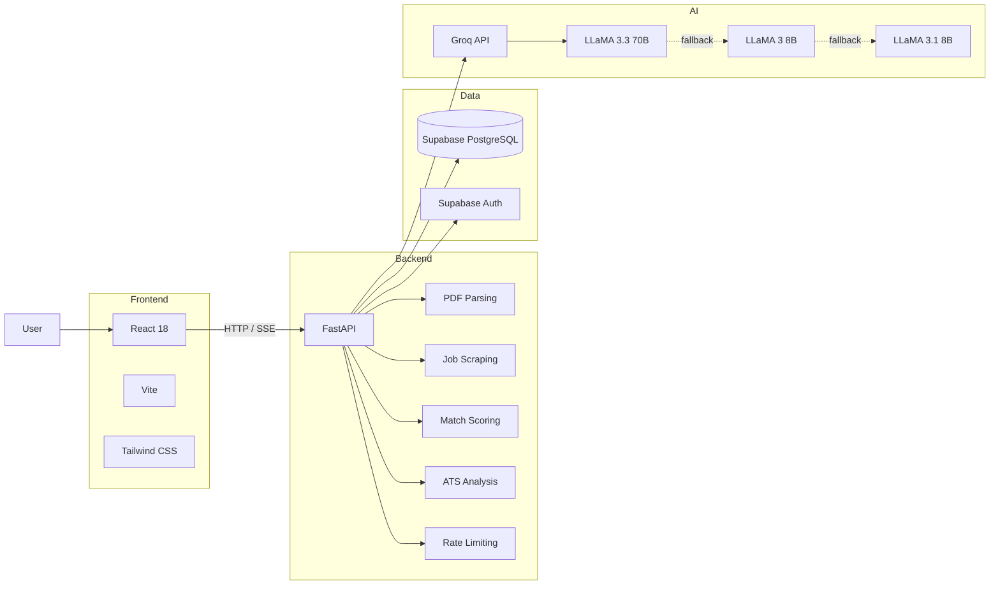

<div align="center">

# 🤖 HireLens

### AI-Powered Recruitment & Job Application Platform

**CV analysis · Job matching · ATS auditing · Interview preparation · Application tracking**

<p>
  <a href="https://hirelens-alpha.vercel.app">
    
  </a>
  <a href="https://github.com/azim-haffar/HireLens">
    
  </a>
</p>

<p>
  
  
  
  
  
  
  
  
</p>

</div>

---

## Overview

**HireLens** is a full-stack recruitment platform that helps job seekers understand how well their CV matches a specific vacancy and identify areas they can improve.

Users can upload a PDF CV, paste or ingest a job posting, and receive structured analysis across skills, experience, education, and keyword coverage.

The platform includes:

- weighted CV-to-job match scoring
- AI-generated match explanations
- ATS auditing
- CV comparison
- interview preparation
- cover-letter generation
- application tracking
- analysis history
- multilingual support
- contextual AI chat
- public CV feedback

The application combines a **React frontend**, **FastAPI backend**, **Supabase / PostgreSQL**, and **Groq-hosted LLMs**, with public deployment through **Vercel and Render**.

---

## 📸 Screenshots

<table>
<tr>
<td width="50%" valign="top">

### Landing


</td>
<td width="50%" valign="top">

### Dashboard


</td>
</tr>

<tr>
<td width="50%" valign="top">

### Job Analysis


</td>
<td width="50%" valign="top">

### ATS Checker


</td>
</tr>
</table>

<div align="center">

### Roast My CV


</div>

---

## ✨ Core Features

<table>
<tr>
<td width="50%" valign="top">

### 📄 CV & Job Analysis

- PDF CV upload and text extraction
- Job description ingestion
- Job URL scraping
- Structured CV/job extraction
- Weighted match scoring
- Skills and keyword coverage
- Education and experience analysis

</td>

<td width="50%" valign="top">

### 🎯 Application Support

- ATS compliance audit
- Role-specific interview questions
- STAR answer frameworks
- Tailored cover-letter generation
- CV-to-CV comparison
- Analysis history and trends

</td>
</tr>

<tr>
<td width="50%" valign="top">

### 📋 Job Tracking

- Drag-and-drop Kanban board
- Saved
- Applied
- Interview
- Offer
- Rejected
- Ghosted

</td>

<td width="50%" valign="top">

### 🤖 AI Features

- SSE-streamed explanations
- Contextual AI chat
- Structured LLM outputs
- Multi-model fallback
- Public CV feedback
- Rate-limited public endpoint

</td>
</tr>
</table>

---

## 🧠 Match Scoring

HireLens calculates a deterministic weighted CV-to-job match score using four categories:

| Category | Weight |
|---|---:|
| Skills | **35%** |
| Experience | **25%** |
| Education | **15%** |
| Keywords | **25%** |

The scoring layer evaluates the structured CV and job data before calculating the final score.

```text
CV + Job
   │
   ├──► Skills fit ────────── 35%
   ├──► Experience fit ────── 25%
   ├──► Education fit ─────── 15%
   └──► Keyword coverage ──── 25%
                    │
                    ▼
             Weighted score
                    │
                    ▼
                 0–100
```

The numerical score is generated separately from the natural-language explanation.

A detailed AI explanation can then be streamed to the frontend using **Server-Sent Events (SSE)**.

This keeps the scoring logic distinct from the LLM-generated explanation.

---

## 🏗️ Architecture



### Request Flow

```text
User
  │
  ▼
React / Vite
  │
  ├── REST requests
  └── SSE streams
  │
  ▼
FastAPI
  │
  ├── CV parsing
  ├── Job ingestion
  ├── Match scoring
  ├── ATS analysis
  ├── Interview preparation
  ├── Cover-letter generation
  ├── Application tracking
  └── AI chat
  │
  ├──────────────► Supabase
  │                 PostgreSQL
  │                 Auth / RLS
  │
  └──────────────► Groq API
                    LLM inference
```

---

## 🛠️ Tech Stack

| Layer | Technology |
|---|---|
| **Frontend** | React 18, Vite, Tailwind CSS, react-i18next, Recharts, @dnd-kit |
| **Backend** | Python 3.11, FastAPI, Pydantic, SlowAPI |
| **Document Processing** | pdfplumber |
| **Job Ingestion** | BeautifulSoup4, requests, httpx |
| **AI** | Groq API, LLaMA models |
| **Database** | Supabase / PostgreSQL |
| **Authentication** | Supabase Auth, Google OAuth |
| **Security / Data** | Row-Level Security |
| **Streaming** | Server-Sent Events |
| **Deployment** | Vercel, Render |
| **Local Infrastructure** | Docker, Docker Compose |

---

## ⚙️ Engineering Highlights

### Deterministic Match Scoring

The core match score is calculated in application code rather than being delegated entirely to an LLM.

The scoring layer evaluates:

```text
Skills
+
Experience
+
Education
+
Keyword coverage
```

before applying the configured weights.

This makes the numerical score more predictable and separates it from the generated explanation.

---

### Real-Time AI Streaming

Long-form responses are streamed from FastAPI to the frontend using **Server-Sent Events**.

```text
Groq API
   │
   │ streamed tokens
   ▼
FastAPI
   │
   │ SSE
   ▼
React frontend
   │
   ▼
Progressive rendering
```

This is used for workflows where displaying the response progressively gives a better user experience than waiting for the complete model output.

---

### Structured LLM Outputs

Several workflows require machine-readable AI responses rather than free-form text.

The backend can request structured JSON output from the configured Groq models and then validate the returned data before using it in the application.

This is used alongside deterministic application logic rather than replacing it.

---

### Supabase Authentication & Row-Level Security

Authentication is handled through **Supabase**, including support for:

- email/password authentication
- Google OAuth
- PostgreSQL persistence
- Row-Level Security

RLS provides database-level access controls for user-owned data.

---

### Public Rate-Limited Endpoint

The public **Roast My CV** endpoint can be used without authentication.

To reduce abuse, the FastAPI application applies IP-based rate limiting through **SlowAPI**.

```text
3 requests / hour / IP
```

The endpoint also restricts uploads to PDF files and enforces a file-size limit.

---

### Application Tracker

HireLens includes a drag-and-drop application tracker built around common recruitment stages:

```text
Saved
  │
  ▼
Applied
  │
  ▼
Interview
  │
  ▼
Offer

Rejected / Ghosted
```

---

### Multilingual Interface

The interface supports:

`English` · `German` · `Spanish` · `Danish` · `Turkish`

Localization is handled with `react-i18next`.

---

## 🤖 AI Model Fallback

The Groq integration uses an ordered fallback chain.

If the preferred model request fails, the backend attempts the next configured model.

```text
llama-3.3-70b-versatile
          │
          ▼
    llama3-8b-8192
          │
          ▼
 llama-3.1-8b-instant
```

| Priority | Model | Role |
|---|---|---|
| 1 | `llama-3.3-70b-versatile` | Primary |
| 2 | `llama3-8b-8192` | Fallback |
| 3 | `llama-3.1-8b-instant` | Final fallback |

The same fallback strategy is available for both normal responses and streamed responses.

---

## 🔍 What This Project Demonstrates

HireLens is primarily a **full-stack backend and AI-integration project**.

It combines:

```text
Document Processing
        +
REST API Design
        +
Structured Data Extraction
        +
Deterministic Scoring
        +
LLM Integration
        +
Streaming Responses
        +
Authentication
        +
PostgreSQL Persistence
        +
React
        +
Containerization
        +
Public Deployment
```

The strongest engineering evidence is the integration of multiple application concerns into one deployed system:

- extracting text from uploaded CVs
- ingesting job descriptions and URLs
- structuring CV and vacancy information
- calculating repeatable weighted match scores
- implementing ATS analysis workflows
- integrating external LLM APIs
- validating structured AI outputs
- streaming generated responses
- authenticating users
- persisting user data
- applying database access controls
- supporting public and authenticated workflows
- maintaining application history
- tracking job applications
- containerizing the application
- deploying frontend and backend services separately

---

## 🚀 Quick Start

### Prerequisites

You need:

- Node.js 18+
- Python 3.11+
- Docker + Docker Compose
- Supabase project
- Groq API key

---

### Option 1 — Docker Compose

Clone the repository:

```bash
git clone https://github.com/azim-haffar/HireLens.git
cd HireLens
```

Create the environment files:

```bash
cp backend/.env.example backend/.env
cp frontend/.env.example frontend/.env
```

Add the required credentials to both `.env` files.

Start the stack:

```bash
docker compose up --build
```

### Docker Services

| Service | URL |
|---|---|
| Frontend | http://localhost:5173 |
| Backend API | http://localhost:8001 |
| Swagger / API Docs | http://localhost:8001/docs |

---

### Option 2 — Local Development

#### Backend

```bash
cd backend

python -m venv venv
source venv/bin/activate
```

Windows:

```bash
venv\Scripts\activate
```

Install dependencies:

```bash
pip install -r requirements.txt
```

Run FastAPI:

```bash
uvicorn app.main:app --reload
```

The backend will normally be available at:

```text
http://localhost:8000
```

API documentation:

```text
http://localhost:8000/docs
```

---

#### Frontend

Open another terminal:

```bash
cd frontend

cp .env.example .env

npm install
npm run dev
```

Open:

```text
http://localhost:5173
```

---

## 🗄️ Supabase Setup

1. Create a Supabase project.
2. Open the SQL Editor.
3. Run:

```text
supabase/migrations.sql
```

4. Configure authentication providers as required.

For Google OAuth:

```text
Authentication
    │
    ▼
Providers
    │
    ▼
Google
```

5. Add the project URL and API keys to the backend and frontend environment files.

---

## 🔐 Environment Variables

### Backend

Create:

```text
backend/.env
```

| Variable | Purpose |
|---|---|
| `GROQ_API_KEY` | Groq API access |
| `SUPABASE_URL` | Supabase project URL |
| `SUPABASE_ANON_KEY` | Supabase anonymous/public key |
| `SUPABASE_SERVICE_ROLE_KEY` | Server-side Supabase access |
| `RESEND_API_KEY` | Transactional email configuration |
| `REDIS_URL` | Redis service configuration |
| `ENVIRONMENT` | Development / production mode |

---

### Frontend

Create:

```text
frontend/.env
```

| Variable | Purpose |
|---|---|
| `VITE_SUPABASE_URL` | Supabase project URL |
| `VITE_SUPABASE_ANON_KEY` | Public Supabase key |
| `VITE_API_URL` | Backend API URL |

> Never commit production API keys, service-role credentials, or other secrets.

---

## 🌐 Deployment

HireLens uses separate frontend and backend deployments:

```text
React / Vite
     │
     ▼
   Vercel


FastAPI
   │
   ▼
 Render
```

### Frontend — Vercel

The production frontend is available at:

**https://hirelens-alpha.vercel.app**

The frontend can be deployed from the `frontend` directory:

```bash
vercel --cwd frontend
```

Configure the required `VITE_*` environment variables in Vercel.

---

### Backend — Render

The repository includes a `render.yaml` configuration.

Backend build command:

```text
pip install -r requirements.txt
```

Start command:

```text
uvicorn app.main:app --host 0.0.0.0 --port $PORT
```

Production credentials are configured through Render environment variables rather than committed to the repository.

---

## 🔌 API

FastAPI exposes interactive API documentation at:

```text
/docs
```

when the backend is running.

### API Areas

The backend is split into dedicated routers for:

| Area | Purpose |
|---|---|
| `/cv` | CV upload and parsing |
| `/jobs` | Job ingestion |
| `/match` | CV-to-job scoring |
| `/ats` | ATS analysis |
| `/explain` | Streamed match explanations |
| `/interview` | Interview preparation |
| `/cover-letter` | Cover-letter generation |
| `/comparison` | CV comparison |
| `/tracker` | Application tracking |
| `/history` | Analysis history |
| `/roast` | Public CV feedback |
| `/chat` | Context-aware AI chat |
| `/health` | API health check |

---

## 📁 Project Structure

```text
HireLens/
│
├── backend/
│   ├── app/
│   │   ├── core/
│   │   │   ├── config.py
│   │   │   ├── deps.py
│   │   │   ├── groq_client.py
│   │   │   └── supabase_client.py
│   │   │
│   │   ├── models/
│   │   │
│   │   ├── routers/
│   │   │   ├── ats.py
│   │   │   ├── chat.py
│   │   │   ├── comparison.py
│   │   │   ├── cover_letter.py
│   │   │   ├── cv.py
│   │   │   ├── explain.py
│   │   │   ├── history.py
│   │   │   ├── interview.py
│   │   │   ├── jobs.py
│   │   │   ├── match.py
│   │   │   ├── roast.py
│   │   │   └── tracker.py
│   │   │
│   │   ├── services/
│   │   │   ├── ats_checker.py
│   │   │   ├── cv_parser.py
│   │   │   ├── deep_ats_checker.py
│   │   │   ├── email_service.py
│   │   │   ├── job_scraper.py
│   │   │   └── match_scorer.py
│   │   │
│   │   └── main.py
│   │
│   ├── .env.example
│   ├── requirements.txt
│   └── Dockerfile
│
├── frontend/
│   ├── src/
│   │   ├── components/
│   │   ├── pages/
│   │   ├── hooks/
│   │   ├── lib/
│   │   └── locales/
│   │
│   ├── public/
│   ├── .env.example
│   ├── package.json
│   └── Dockerfile
│
├── screenshots/
│
├── supabase/
│   └── migrations.sql
│
├── docker-compose.yml
├── render.yaml
├── LICENSE
└── README.md
```

---

## 🎬 Demo

<div align="center">

### Try HireLens

<a href="https://hirelens-alpha.vercel.app">
  
</a>

<a href="https://github.com/azim-haffar/HireLens">
  
</a>

</div>

---

## 📄 License

Distributed under the **MIT License**.

See [`LICENSE`](LICENSE) for details.

---

<div align="center">

### Built by Azim Haffar

**Backend Engineering · AI Integration · Full-Stack Development**

<a href="https://azimx.dev">
  
</a>

<a href="https://www.linkedin.com/in/azim-haffar">
  
</a>

<a href="https://github.com/azim-haffar">
  
</a>

</div>
