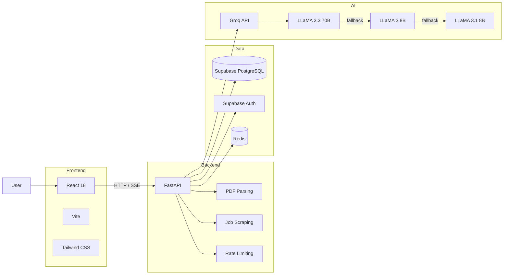

<div align="center">

# 🤖 HireLens

### AI-Powered Recruitment & Job Application Platform

**CV analysis · Job matching · ATS auditing · Interview preparation · Application tracking**

<p>
  <a href="https://hirelens-alpha.vercel.app">
    
  </a>
  <a href="https://github.com/azim-haffar/HireLens">
    
  </a>
</p>

<p>
  
  
  
  
  
  
  
</p>

</div>

---

## Overview

**HireLens** is a full-stack recruitment platform that helps job seekers understand how well their CV matches a specific vacancy and what they can improve.

Users can upload a PDF CV, paste or ingest a job posting, and receive structured analysis across skills, experience, education, and keyword coverage.

The platform also includes:

- AI-powered match scoring
- ATS auditing
- CV comparison
- interview preparation
- cover-letter generation
- application tracking
- analysis history
- multilingual support
- contextual AI chat

The application combines a **React frontend**, **FastAPI backend**, **Supabase**, **Redis**, and **Groq-hosted LLMs**, with deployment through **Vercel and Render**.

---

## 📸 Screenshots

<table>
<tr>
<td width="50%" valign="top">

### Landing


</td>
<td width="50%" valign="top">

### Dashboard


</td>
</tr>

<tr>
<td width="50%" valign="top">

### Job Analysis


</td>
<td width="50%" valign="top">

### ATS Checker


</td>
</tr>
</table>

<div align="center">

### Roast My CV


</div>

---

## ✨ Core Features

<table>
<tr>
<td width="50%" valign="top">

### 📄 CV & Job Analysis

- PDF CV upload and parsing
- Job description ingestion
- Job URL scraping
- Structured CV/job extraction
- Weighted match scoring
- Skills and keyword coverage
- Education and experience analysis

</td>
<td width="50%" valign="top">

### 🎯 Application Support

- ATS compliance audit
- Role-specific interview questions
- STAR answer frameworks
- Tailored cover-letter generation
- CV-to-CV comparison
- Analysis history and trends

</td>
</tr>

<tr>
<td width="50%" valign="top">

### 📋 Job Tracking

- Drag-and-drop Kanban board
- Saved
- Applied
- Interview
- Offer
- Rejected
- Ghosted

</td>
<td width="50%" valign="top">

### 🤖 AI Features

- SSE-streamed explanations
- Contextual AI chat
- Public CV feedback endpoint
- Multi-model fallback chain
- Structured LLM outputs
- Rate-limited public features

</td>
</tr>
</table>

---

## 🧠 Match Scoring

HireLens calculates a weighted job-match score using four categories:

| Category | Weight |
|---|---:|
| Skills | **35%** |
| Experience | **25%** |
| Education | **15%** |
| Keywords | **25%** |

The score is accompanied by a detailed AI-generated explanation streamed to the frontend using **Server-Sent Events (SSE)**.

---

## 🏗️ Architecture



### Request flow

```text
User
  │
  ▼
React / Vite
  │
  ├── REST requests
  └── SSE streams
  │
  ▼
FastAPI
  │
  ├── CV parsing
  ├── Job ingestion
  ├── ATS analysis
  ├── Match scoring
  ├── Interview preparation
  └── AI chat
  │
  ├──────────────► Supabase
  │                 PostgreSQL
  │                 Auth / RLS
  │
  ├──────────────► Redis
  │                 Cache / rate limiting
  │
  └──────────────► Groq API
                    LLM inference
```

---

## 🛠️ Tech Stack

| Layer | Technology |
|---|---|
| **Frontend** | React 18, Vite, Tailwind CSS, react-i18next, Recharts, @dnd-kit |
| **Backend** | Python 3.11, FastAPI, SlowAPI, pdfplumber, BeautifulSoup4 |
| **AI** | Groq API, LLaMA models |
| **Database** | Supabase / PostgreSQL |
| **Authentication** | Supabase Auth, Google OAuth |
| **Security / Data** | Row-Level Security |
| **Cache / Rate Limit** | Redis |
| **Streaming** | Server-Sent Events |
| **Deployment** | Vercel, Render |
| **Local Infrastructure** | Docker Compose |

---

## ⚙️ Engineering Highlights

### Real-Time AI Streaming

Long-form AI responses are streamed from the FastAPI backend to the frontend using **SSE**, allowing explanations and AI chat responses to appear progressively instead of waiting for the full model response.

### Supabase Authentication & RLS

Authentication is handled through **Supabase**, supporting:

- email/password authentication
- Google OAuth
- PostgreSQL persistence
- Row-Level Security

### Public Rate-Limited Endpoint

The public **Roast My CV** feature works without authentication while using rate limiting to reduce abuse.

```text
3 requests / hour / IP
```

### Application Tracker

The tracker uses a drag-and-drop Kanban interface:

```text
Saved
  ↓
Applied
  ↓
Interview
  ↓
Offer

Rejected / Ghosted
```

### Multilingual Interface

HireLens currently supports:

`English` · `German` · `Spanish` · `Danish` · `Turkish`

using `react-i18next`.

---

## 🤖 AI Model Fallback

The backend uses a fallback chain so the application can switch models if the preferred option is unavailable.

```text
llama-3.3-70b-versatile
          │
          ▼
    llama3-8b-8192
          │
          ▼
 llama-3.1-8b-instant
```

| Priority | Model | Role |
|---|---|---|
| 1 | `llama-3.3-70b-versatile` | Primary |
| 2 | `llama3-8b-8192` | Fallback |
| 3 | `llama-3.1-8b-instant` | Final fallback |

---

## 🚀 Quick Start

### Prerequisites

You need:

- Node.js 18+
- Python 3.11+
- Docker + Docker Compose
- Supabase project
- Groq API key

---

### Option 1 — Docker Compose

```bash
git clone https://github.com/azim-haffar/HireLens.git
cd HireLens
```

Configure environment variables:

```bash
cp backend/.env.example backend/.env
cp frontend/.env.example frontend/.env
```

Add your credentials to the `.env` files.

Then start the application:

```bash
docker-compose up --build
```

### Local services

| Service | URL |
|---|---|
| Frontend | http://localhost:5173 |
| Backend API | http://localhost:8001 |
| Swagger / API Docs | http://localhost:8001/docs |

---

### Option 2 — Local Development

#### Backend

```bash
cd backend

python -m venv venv
source venv/bin/activate

# Windows
# venv\Scripts\activate

pip install -r requirements.txt

uvicorn app.main:app --reload
```

#### Frontend

```bash
cd frontend

npm install
npm run dev
```

---

## 🗄️ Supabase Setup

1. Create a project at [supabase.com](https://supabase.com).
2. Open the SQL Editor.
3. Run:

```text
supabase/migrations.sql
```

4. Enable Google OAuth under:

```text
Authentication
    ↓
Providers
    ↓
Google
```

5. Add the project URL and API keys to the backend and frontend environment files.

---

## 🔐 Environment Variables

### Backend

`backend/.env`

| Variable | Purpose |
|---|---|
| `GROQ_API_KEY` | Groq API access |
| `SUPABASE_URL` | Supabase project URL |
| `SUPABASE_ANON_KEY` | Public Supabase API key |
| `SUPABASE_SERVICE_ROLE_KEY` | Server-side Supabase key |
| `RESEND_API_KEY` | Transactional email |
| `REDIS_URL` | Redis connection |
| `ENVIRONMENT` | Development / production mode |

### Frontend

`frontend/.env`

| Variable | Purpose |
|---|---|
| `VITE_SUPABASE_URL` | Supabase project URL |
| `VITE_SUPABASE_ANON_KEY` | Public Supabase key |
| `VITE_API_URL` | Backend API URL |

> Never commit production API keys or service-role credentials.

---

## 🌐 Deployment

### Frontend — Vercel

```bash
vercel --cwd frontend
```

Configure the `VITE_*` environment variables inside the Vercel project.

### Backend — Render

The backend can be deployed through the included `render.yaml` configuration.

Manual configuration:

```text
Build:
pip install -r requirements.txt

Start:
uvicorn app.main:app --host 0.0.0.0 --port $PORT
```

---

## 🔌 API

Interactive API documentation is available through FastAPI at:

```text
/docs
```

when the backend is running.

### Main endpoints

| Method | Endpoint | Purpose |
|---|---|---|
| `POST` | `/cv/upload` | Upload and parse CV |
| `POST` | `/jobs/ingest` | Ingest job posting |
| `POST` | `/match/score` | Generate match score |
| `POST` | `/ats/check` | Run ATS audit |
| `POST` | `/explain/stream` | Stream score explanation |
| `POST` | `/interview/generate` | Generate interview preparation |
| `POST` | `/cover-letter/generate` | Generate cover letter |
| `POST` | `/comparison/compare` | Compare CV versions |
| `GET` | `/tracker/applications` | Retrieve applications |
| `POST` | `/roast/cv` | Public CV feedback |
| `POST` | `/chat/stream` | Context-aware AI chat |

---

## 📁 Project Structure

```text
HireLens/
│
├── backend/
│   ├── app/
│   │   ├── routers/
│   │   │   ├── cv
│   │   │   ├── jobs
│   │   │   ├── match
│   │   │   ├── ats
│   │   │   └── ...
│   │   │
│   │   ├── services/
│   │   │   ├── CV parsing
│   │   │   ├── Job scraping
│   │   │   └── Groq client
│   │   │
│   │   ├── models/
│   │   └── main.py
│   │
│   ├── requirements.txt
│   └── Dockerfile
│
├── frontend/
│   ├── src/
│   │   ├── components/
│   │   ├── pages/
│   │   ├── hooks/
│   │   ├── lib/
│   │   └── locales/
│   │
│   └── public/
│
├── supabase/
│   └── migrations.sql
│
└── docker-compose.yml
```

---

## 🎬 Demo

<div align="center">

### Try HireLens

<a href="https://hirelens-alpha.vercel.app">
  
</a>

</div>

---

## 📄 License

Distributed under the **MIT License**.

See [`LICENSE`](LICENSE) for details.

---

<div align="center">

### Built by Azim Haffar

Backend · AI Integration · Full-Stack Engineering

<a href="https://azimx.dev">
  
</a>

<a href="https://www.linkedin.com/in/azim-haffar">
  
</a>

<a href="https://github.com/azim-haffar">
  
</a>

</div>
